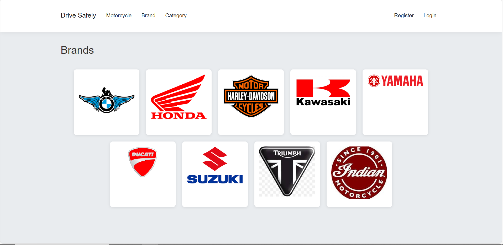
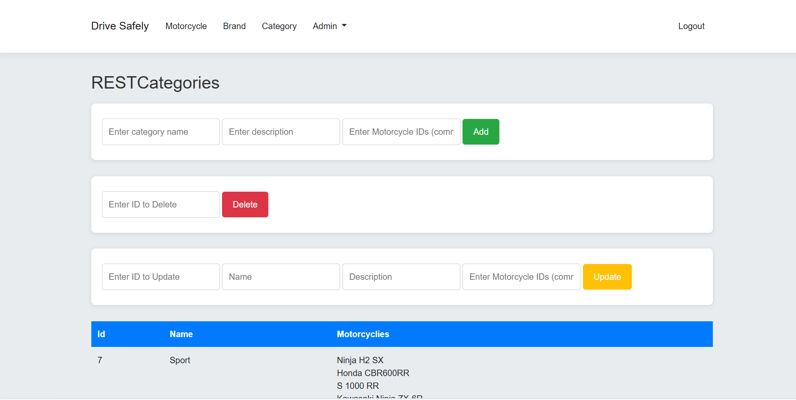

# Moto Shop Web Application

## Overview

This is a **learning project** developed using Razor Pages in ASP.NET Core. The project represents a prototype for an online motorcycle store where users can browse motorcycles by brand or category. It includes basic functionalities for administrators to manage data, such as motorcycles, brands, and categories. In the future, a payment system like Stripe will be integrated to enable purchases.

----------

## Features

### User Features:

-   Browse motorcycles by:
    -   Brand
    -   Category
-   View detailed information about each motorcycle.

### Admin Features:

-   Add, edit, or delete motorcycles, brands, and categories.
-   Add new admin users.

----------

## Technologies Used

-   **ASP.NET Core 6.0** with Razor Pages
-   **Entity Framework Core 7.0** with PostgreSQL
-   **Identity Framework** for authentication and user management
-   **Cookie Authentication**

----------

## Prerequisites

To run the project locally, you need:

1.  .NET 6.0 SDK or higher
2.  PostgreSQL server

----------

## Installation and Setup

1.  Clone the repository.
    
2.  Navigate to the project directory.

3.  Restore dependencies.
    
4.  Update the database.
    
5. Add appsettings.json file and config this file:
```json
{
  "ConnectionStrings": {
    "DefaultConnectionString": "Host=your_host;Database=your_database;Username=your_username;Password=your_password"
  }
}
```
Replace `your_host`, `your_database`, `your_username`, and `your_password` with the appropriate PostgreSQL credentials.

7.  Run the application.
 
    

----------

## Future Enhancements

-   Add a fully functional payment gateway (e.g., Stripe).
-   Deploy the project to a cloud provider.

----------

## Screenshots

### Home Page (User View)



### Admin Panel



----------

## License

This is a learning project and does not include a license. Contributions are welcome to improve the codebase.

## Contact

If you have any questions or suggestions, feel free to reach out: 
- **GitHub**: [andrunovostavskyi](https://github.com/andrunovostavskyi) 
- **LinkedIn**: https://www.linkedin.com/in/andriy-novostavskyi-073879325/
-  **Email**: novostavskuy@gmail.com
